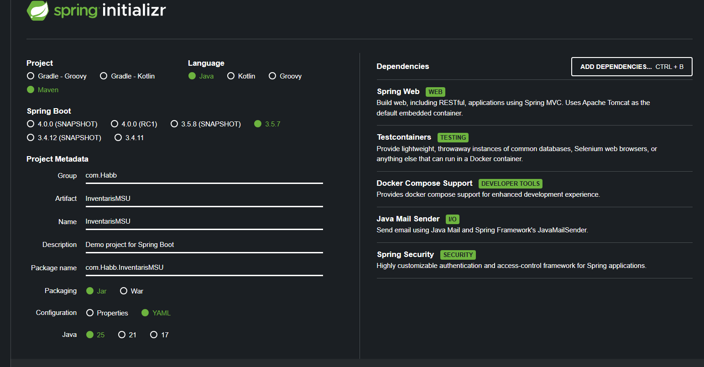
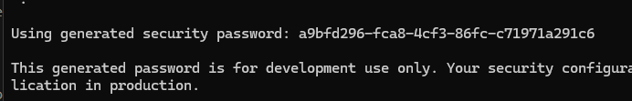

# Pre-Requisites
1. Install Java 25
2. Install Maven 3.9
3. Install JDK 25
4. VS Code / IDE lainya
5. Docker Desktop

# Initial Setup Springboot
1. buka https://start.spring.io/ 

2. Extract file zip yang sudah di download
3. Paste di working directory
4. Buka project di VS Code / IDE lainya
5. buka pom.xml
6. Tambahkan dependency berikut di dalam tag `dependencies`
```		
        <dependency>
			<groupId>org.postgresql</groupId>
			<artifactId>postgresql</artifactId>
			<scope>runtime</scope>
		</dependency>
		<dependency>
			<groupId>org.springframework.boot</groupId>
			<artifactId>spring-boot-starter-thymeleaf</artifactId>
		</dependency>
	    <dependency>
			<groupId>org.springframework.boot</groupId>
			<artifactId>spring-boot-starter-validation</artifactId>
		</dependency>
		<dependency>
			<groupId>org.springdoc</groupId>
			<artifactId>springdoc-openapi-starter-webmvc-ui</artifactId>
			<version>2.6.0</version>
		</dependency>
```		
# LANGSUNG JALANIN DARI SINI
7. jalankan perintah berikut di terminal yang sama dengan working directory project
```
mvn spring-boot:run
```
8. buka browser dan akses http://localhost:8080/
9. Login menggunakan username: `user` dan password: yang tersedia di terminal seperti berikut
